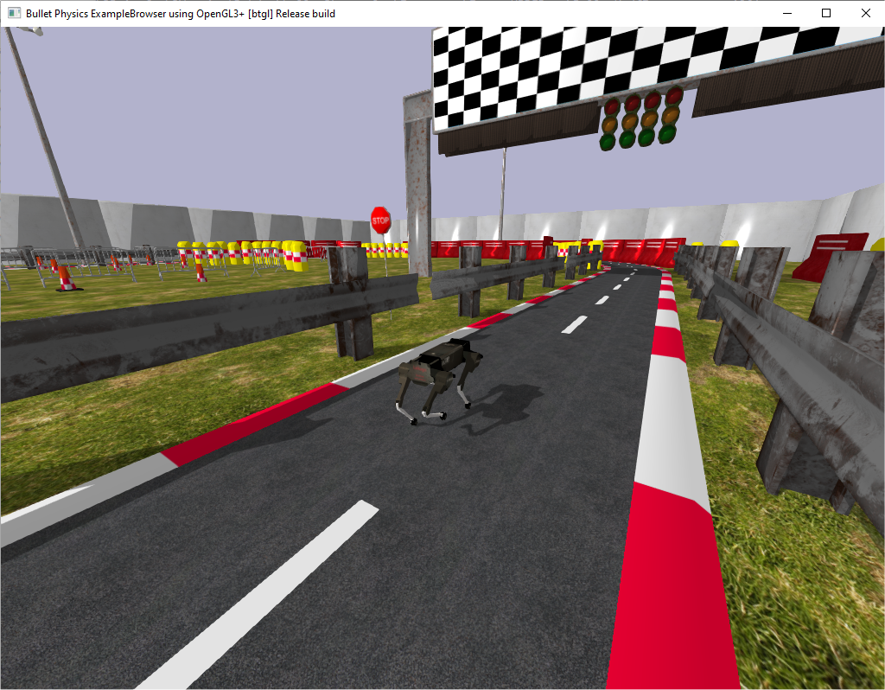

# PyBullet Racetrack MPC Example



# Installation

On Windows, Linux and Mac OSX you can use:

```
pip3 install pybullet --upgrade --user
pip3 install motion_imitation
python3 mpc_locomotion_controller_example.py
```

# Include the world from another package

```
from pybullet_utils import gazebo_world_parser
import pybullet as p
p.connect(p.GUI)
bodies = gazebo_world_parser.parseWorld( p, filepath = "worlds/racetrack_day.world")
```

